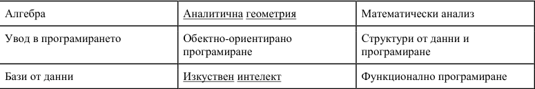

# String

1. **Задача** Да се напише програма, която установява дали даден низ е палиндром, т.е. четен отляво надясно и отдясно наляво е един и същ.

 

2. **Задача** Да се напише програма, която намира броя на срещанията на всеки символ от вида '!' , '?' , ',' в даден низ.

 

3. **Задача** Даден е низ. Да се напише програма, която намира броя на думите в низа. Дума е редица от символи. Разделител между думите е символът интервал.

 

4. **Задача** Даден е низ, образуван от главни латински букви. Да напише програма, която конструира същия низ, но от съответните малките латински букви.

 

5. **Задача** Напишете програма, която въвежда два знакови низа S1 и S2 и като резултат отпечатва онези малки латински букви, които се съдържат в низа S1, но не се съдържат в низа S2.

 

6. **Задача** Даден е низ, образуван от главни латински букви. Да се напише програма, която установява дали буквите, участващи в низа са различни.

 

7. **Задача** Напишете подпрограма, определя колко пъти символният низ S2 се съдържа в S1.

 

8. **Задача** Да се напише програма, която установява дали броят на срещанията на думата 'begin' в даден низ е равен на броя на срещанията на думата 'end' в същия низ.

 

9. **Задача** Напишете програма, която въвежда знаков низ S и като резултат отпечатва онези малки латински букви, които не се съдържат в низа.

 

10. **Задача** Дадени са две цели числа, записани като знакови низове. Напишете програма, която определя кое от двете числа е по-голямо.

 

11. **Задача** Да се напише програма, която сортира във възходящ ред елементите на редица от числа във формата на низове.
 

12. **Задача**  Напишете програма, която въвежда цяло число и извежда двоичния (шeстнадесетичният) му запис.

 

13. **Задача** Професор Х крие парола. На всеки ред от библиотеката му са подредени книги, най-много 20 реда книги, с до 30 книги на ред. Книгите на някои от редовете са подредени по азбучен ред на заглавията си, всяко от които е до 100 символа.  
Паролата за сейфа на професор X се определя от числата, които задават последователните дължини на думите в заглавията на книгите, разположени точно в средата на редовете, в които книгите са подредени в азбучен ред. Ако на реда има четен брой книги, за паролата се използва книгата, намираща се по-близо до началото на  реда.  Думите  в  заглавията  на  книгите  са  разделени  от  точно  един  интервал.  Дължините  на  думите формират паролата в реда, в който се срещат, от най-горния към най-долния ред на библиотеката.  
Библиотеката  на  Х  може  да  се  представи  като  двумерен  масив **a** от  низове  с **m** реда  по **n** низа  всеки, представящи заглавията на книгите. Да се дефинира функция ***revealPassword***, която по подадени **a**, **m** и **n**, извежда на стандартния изход паролата на професор X като последователност от числа, разделени с по един интервал. 
**Пример:** 
     
Тогава паролата на професор X е поредицата от числа 10 9 9 8, получена от дължините на подчертаните думи. Думите “Обектно-ориентирано програмиране” не участват в паролата, защото книгите на втория ред не са подредени по азбучен ред на заглавията си.

 

14. **Задача** Да се състави функция, която приема като параметър низ с произволна дължина и връща като резултат позициите на двойката **еднакви** символи, които са максимално отдалечени един от друг. Ако в низа съществуват няколко двойки максимално отдалечени символи, функцията да връща позициите на най-ляво разположената двойка. Счита се, че номерата на позициите започват от 0.  
**Пример** 
*Вход:* "this is just a simple example" 
*Изход:* 4 21 
*Пояснение:* символи ' ' (интервали) са на позиции, съответно 4 и 21, намират се наразстояние 17 символа един от друг и няма друга двойка еднакви символи, които са на по-голямо разстояние един от друг  

 

Задачи за самостоятелна работа:
- [Шоколад](http://www.math.bas.bg/infos/files/2008-12-02-D3.pdf)
- [Думи](http://www.math.bas.bg/infos/files/2011-05-08-E4.pdf)
