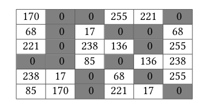

# Структури

1. **Задача** Даден е списък на учениците от 10 клас, съдържащ име, година на раждане, адрес. Напишете програма, която:
	- въвежда година и проверява дали в класа има ученик с такава рождена година;
	- извежда имената и адресите на всички ученици, родени преди определена година.

	---

<br>

2. **Задача** Даден е списък на учениците от един випуск, явили се на поправителен изпит по информатика, съдържащ следната информация: номер в класа, пълно име и получената оценка. Напишете програма, която въвежда информация за **n** (**n** > 1 е дадено ест. число) ученика и като резултат:
	- отпечатва имената на всички ученици с успех над 5,50;
	- определя колко ученика не са издържали изпита (под 3,00);
	- изчислява и извежда средния успех от изпита;
	- отпечатва максималната получена оценка и колко ученика са я получили;
	- имената на всички ученици, получили оценка над средната за класа.

	---

<br>

3. **Задача** За учениците в един клас се съхранява следната информация: пълно име, успех от I срок, успех от II срок. Напишете програма, която въвежда информация за учениците и:
	- отпечатва името на ученика с най-слаб успех за първи срок;
	- отпечатва първото име на ученика с най-висок среден успех за годината.

	---

	**[Решение](../solutions/structs/task03.cpp)**

<br>

4. **Задача** За книгите в една библиотека се пази следната информация: заглавие, автор, издателство, година на издаване. Напишете програма, която въвежда информация за **N** книги и като резултат:
	- въвежда дадена година и извежда списък на всички книги, издадени през тази година;
	- въвежда име на издателство и отпечатва всички автори, издадени от това издателство;
	- определя заглавията на колко от книгите започват с буква А.

	---

<br>

5. **Задача** За всеки чужд турист, посетил страната през дадена година, се събира формацията: име, пол, страна, възраст, колко дни е в България. Напишете програма, която въвежда информация за определен брой туристи и
	- извежда каква е средната възраст на туристите, посетили страната;
	- извежда колко жени са посетили страната ни;
	- извежда името на най-възрастния мъж, посетил страната;
	- извежда колко шведки под 25 години са пребивавали повече от 30 дена в България.

	---

<br>

6. **Задача** Данни за служителите в дадена фирма имат следната структура: Номер; Име; Трудов стаж; Навършени години; Основна заплата. Да се състави програма, която дава възможност за:
	- Въвеждане на данни за служителите;
	- Извеждане на информация за всички служители под 60 години със заплата под минималната;
	- Извеждане на средната заплата за фирмата;
	- Удвояване на заплатата на всички служители, които получават под минималната;
	- Отпечатване на всички данни;
	- Извеждане името на служителя с най-висока(ниска) заплата;
	- Сортиране на данните в низходящ ред по заплата(при равни заплати да се подредят по име във възходящ ред);
	- Актуализиране данни за служител;
	- Изтриване на данни за служител.

	---

<br>

7. **Задача** Данните за издирвани коли имат следната структура: Регистрационен номер; Номер шаси; Номер двигател; Марка; Цвят; Име на собственик; Адрес на собственика. Да се напише програма, която:
	- Въвежда, актуализира и изтрива данни за кола.
	- По зададен номер отпечатва име и адрес на собственика.
	- Отпечатва броя коли от дадена марка.
	- По зададени марка, цвят и последните два символа от рег. номер, отпечатва списък на собствениците на тези коли.
	- Отпечатва всички данни

	---

<br>

8. **Задача** Да се състави програма, която позволява:
	-   Въвеждане на данни за N на брой ученици, кандидатстващи за получаване на стипендия. Информацията за всеки ученик включва: име, успех и точки;
	-   Извежда списък на учениците подредени по намаляване на успеха;
	-   Въвеждане на числото D за долна граница на точките и U – за долна граница на успеха.
	-   Извеждане на справка от данни за учениците, които получават стипендия, съдържаща име и размер на стипендията, като размерът се определя така:
		- с точки >= D и успех >= U - 80 лева;
		- успех >=5,50 - 60 лева;
		- на останалите - 0 лева.
	-   Актуализиране на данните за един ученик, включващо обичайните обработки като допълване, изтриване, промяна на данните за един ученик.

	---

<br>

9. **Задача** (Кандидатстудентски изпит по информатика, 2003 г. – Пловдивски университет) Да се състави компютърна програма за информационно обслужване на училищна библиотека. В библиотеката има до 5000 различни книги и от всяка книга има до 50 екземпляра:
	- Да се въведе и контролира, броят N на всички книги в библиотеката (3<=N<=5000). За всяка книга да се въведе следната информация:
		- сигнатурен номер: 1, 2, 3, ..., N;
		- заглавие: низ не по дълъг от 100 знака;
		- имена на автора: име, презиме и фамилия в един низ, не по-дълъг от 80 знака, в който имената са разделени с точно един интервал;
		- единична цена: реално число в интервала [1.00;99.99] ;
		- брой закупени екземпляри: цяло число в интервала [1;50].
	- Да се изведе списък на всички книги в библиотеката, подреден по сигнатурен номер, като за всяка книга се извежда: сигнатурен номер, заглавие, име на автора във вида: фамилия, инициали на името и презимето, единична цена, брой екземпляри, общата сума заплатена за тези екземпляри, разделени с по един интервал. Инициалите са първата буква на съответното име, последвана от точка. Например за книгата със сигнатурен номер 36, заглавие Под игото, автор Иван Минчов Вазов, единична цена 3.52 лв., от която са закупени 30 екземпляра да се изведе:

		```
		36 Под игото Вазов И.М. 3.52 30 105.60
		```

	- Да се изведе списък на книгите, подредени в низходящ ред на общата сума заплатена за всички екземпляри от съответната книга. Ако има книги с една и съща обща сума, по-напред в списъка да се постави тази, която е с по-малък сигнатурен номер;
	- Да се пресметне и изведе средно аритметичната единична цена S на книгите от библиотеката (средно-аритметичното число на единичните цени). Да се изведе и списък на всички автори, които имат поне три книги с единични цени по-големи от S.

	---

<br>

10.  **Задача** (Кандидатстудентски изпит по информатика, 2004 г. – Пловдивски университет) Запаленият привърженик на играта “Стани богат” Компютко Всезнайков пази информация за въпросите. Помогнете му като направите програма, в която:
     - Да се въведе и контролира броят N на всички въпроси (10<=N<=150). За всеки въпрос да се въведе следната информация:
		-  текст на въпрос – един низ, не по-дълъг от 255 знака
		-  сума за верен отговор на въпроса – цяло число в интервала [100;100000];
		-  възможни отговори – 4 низа до 20 знака всеки;
		-  верен отговор – една от буквите A, B, C, D;
		-  име на участник, отговарял на въпроса – име и фамилия в един низ, не по-дълъг от 30 знака;
		- отговор на участника – една от буквите A, B, C, D или О (отказал се).

	     Правила на играта: Ако участникът е отговорил вярно на всички въпроси , включително и за последната сума от 100 000 лв., той я печели. Иначе печели максималната сума, за която е дал верен отговор при положение, че се е отказал на следващата по-висока сума. При грешен отговор печели последната “твърда” сума (0 лв, 500 лв. или 3000 лв.), за която е дал верен отговор . Например, ако даде грешен отговор за 400 лв., не печели нищо. Ако даде грешен отговор за 2000 лв., печели 500. Ако пък даде грешен отговор за 50000 лв., печели 3000 лв.

	 - Да се изведе информацията за въпросите,подредена низходящо по суми, за които е играно, а при равни суми – възходящо по име на участникът, който е играл за тях.

	 - Да се изведат имената на участниците, спечелили максимална сума.

	 - Да се изведе списък с текстовете на въпросите и верния им отговор, както и броят на думите в текста на всеки въпрос. За разделител между думите служи поне един интервал.

     ---

<br>

11. **Задача** Подават ви се две точки в декартова координатна система. Да се определи дали тези две точки могат да образуват диагонал на квадрат, който има успоредни страни на абсцисата и ордината.

	---

	**[Решение](../solutions/structs/task11.cpp)**

<br>

12. **Задача** Дадени са структура *Point*, описваща точка в декартова координатна система с координати *x* и *y* от тип float, и структура *Circle*, описваща окръжност с център center от тип *Point* и радиус r от тип float.

	Да се дефинира функция findRelativePosition, която определя относителната позиция на две дадени окръжности една спрямо друга.

	Резултатът от изпълнението на функцията е стойност от enum тип:
	`RelativePosition {NO_COMMON_POINTS, TOUCHING, INTERSECTING, SAME}` със следния смисъл:

	- NO_COMMON_POINTS: без общи точки
	- TOUCHING: допиращи се
	- INTERSECTING: пресичащи се
	- SAME: съвпадат

	---

	**[Решение](../solutions/structs/task12.cpp)**

<br>

13. **Задача** Графично  изображение  е  представено  с  матрица  от *m* реда и *n* колони. Клетките  на матрицата, във всяка от които е записана целочислена стойност от 0 до 255, съответстват на пикселите в графичното изображение (формат grayscale).

	Всяка клетка в матрицата има до 8 съседа — до 4 по диагонал, до два, разположени хоризонтално, и до два – вертикално.

	Област в изображението е непрекъсната последователност от съседни клетки с ненулеви стойности. Черните елементи, представени със стойност 0, се считат за контури на областите. Така, една област се определя от граница от нулеви елементи и границите на матрицата.

	Дефинирайте функция, която получава като аргумент матрица от посочения вид извежда на стандартния изход средната яркост на всяка от областите, сортирани в низходящ ред според яркостта.

	Средна яркост на дадената област се изчислява като средно-аритметично на стойностите на всички клетки (пиксели), образуващи областта.

	За всяка област изведете координатите на една произволна клетка от нея и средната яркост на областта.

	Пример: При входна матрица, m = 6, n = 6<br>
	

	Програмата ще изведе следните области и средни яркости, сортирани в низходящ ред според яркостта:
	```text
	(0, 0) 153; (0, 3) 151.11
	```

</br>
